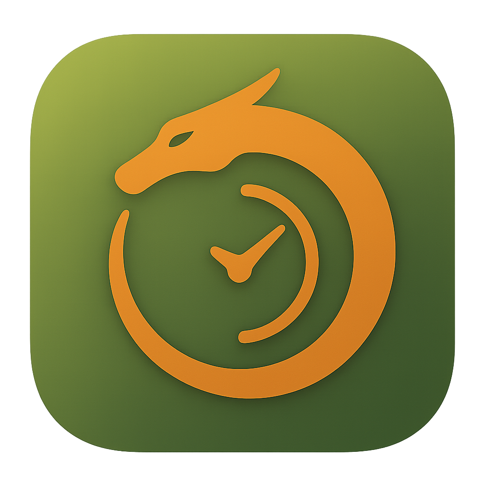

# ⏳ Flowmodoro RPG 🐉



*Por Kiernan Preve*

**Flowmodoro RPG** es una app de productividad gamificada que combina la técnica Pomodoro con elementos de un RPG.  
La idea es simple: cada bloque de enfoque se convierte en una batalla épica contra un jefe, y tus logros diarios se traducen en progreso dentro del juego.  

---

## ✨ Características
- ⏱️ **Pomodoros configurables**: bloques de 25–40 minutos para adaptarse a tu estilo.  
- ⚔️ **Dificultad ajustable**: elige cuánto desafío quieres en tus sesiones.  
- 🎮 **Modo RPG**: enfréntate a enemigos, gana experiencia y sube de nivel.  
- 💎 **Gamificación clara**: recompensas, cofres y gemas para mantenerte motivado.  
- 🌙 **Modos Zen y Enfoque**: minimalista o con elementos RPG, según lo que necesites.  
- 🎨 **UI adaptable**: soporte para claro/oscuro y escalado de interfaz.  

---
## Screenshots


## 🚀 Instalación
```bash
git clone https://github.com/tuusuario/flowmodoro-rpg.git
cd flowmodoro-rpg
python3 FlowmodoroRPG.py
